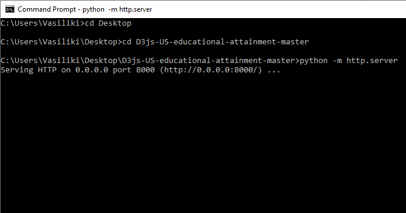
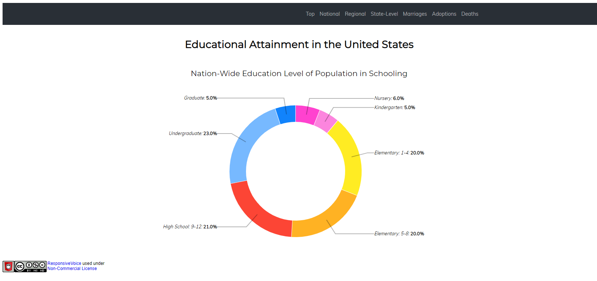
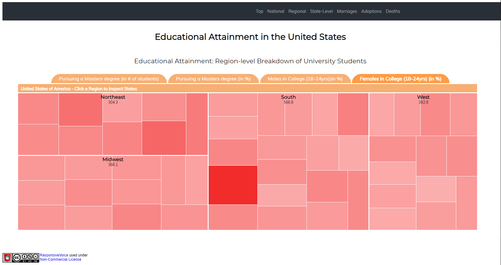
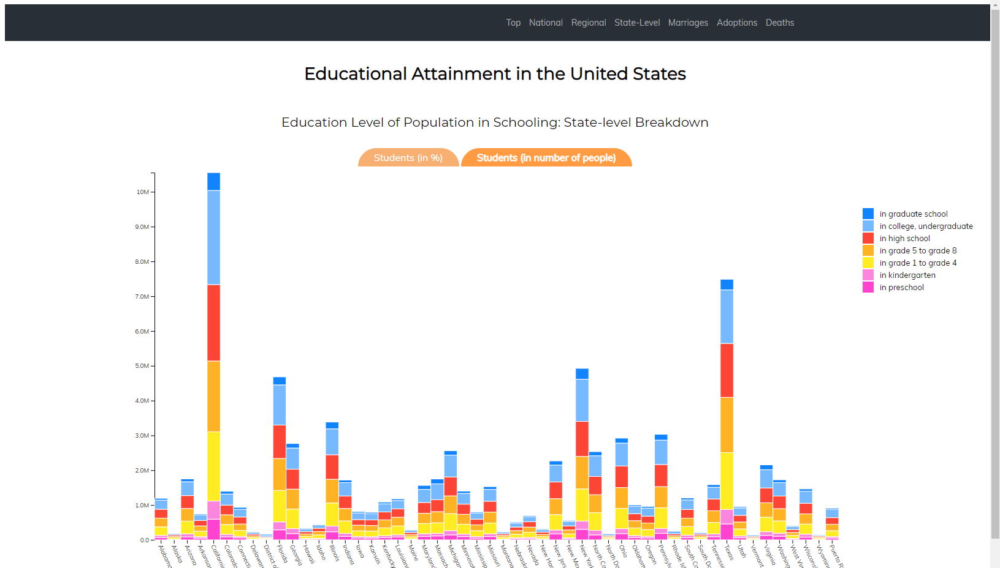
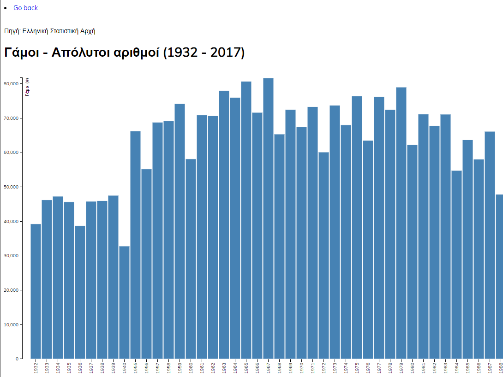
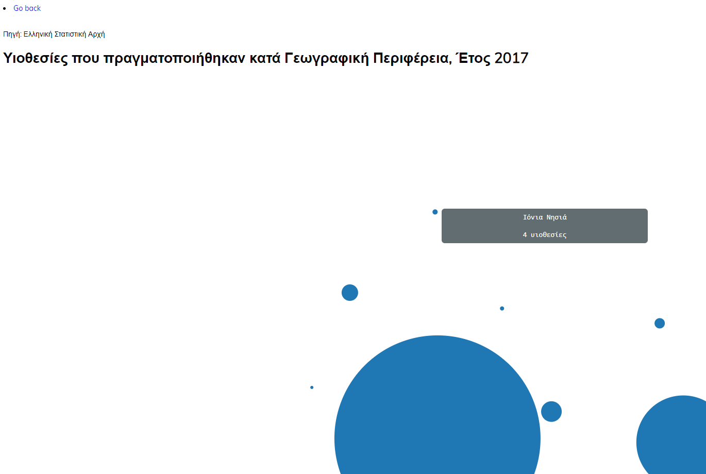
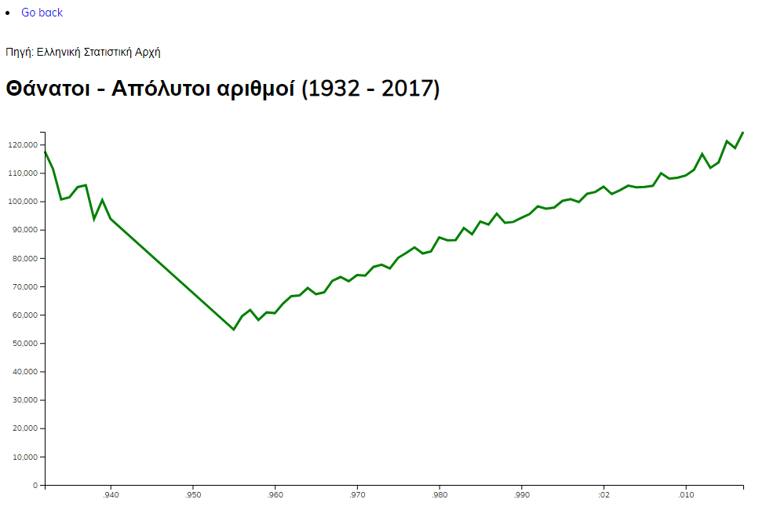

# ΙΟΝΙΟ ΠΑΝΕΠΙΣΤΗΜΙΟ
# Οπτικοποίηση δεδομένων εκπαιδευτικού συστήματος (USA)
## Σύνοψη
* Ονοματεπώνυμο: Βασιλική Πολυχρόνη
* ΑΜ: 2015084
* Ακαδημαϊκό έτος 2018-2019

Σε αυτή την σελίδα παρουσιάζω την εργασία εξαμήνου μου στα πλαίσια του μαθήματος "Επικοινωνία Ανθρώπου-Υπολογιστή". Η εργασία βασίζεται σε υπάρχον παράδειγμα οπτικοποίσης δεδομένων σε ιστοσελίδα, με χρήση HTML, CSS, JavaScript, καθώς και της βιβλιοθήκης D3.js. Επίσης, είναι χωρισμένη σε δύο παραδοτέα, με συγκεκριμένα ζητούμενα το καθένα. Συνολικά, ολοκλήρωσα επιτυχώς 6 από τα 8 ζητούμενα.

## Σύντομη Εισαγωγή
Η αρχική εργασία οπτικοποιεί δεδομένα από το αμερικανικό εκπαιδευτικό σύστημα. Παρουσιάζει τρία βασικά στατιστικά δεδομένα, με χρήση διαγραμμάτων πίτας, "treemap", και ραβδογράμματος. Επισημαίνεται ότι όλα είναι διαδραστικά και όχι απλές εικόνες ή πίνακες.

Στα πλαίσια της εργασίας, κλήθηκα να τροποποιήσω το παράδειγμα για να του προσθέσω νέες λειτουργίες (όπως η αφήγηση κειμένου) ή για να κάνω αλλαγες στην εμφάνιση. Επίσης οπτικοποίησα νέα στατιστικά δεδομένα από την ΕΛΣΤΑΤ, με διαγράμματα της επιλογής μου.

## Ανάλυση Σχετικών Έργων και Εργαλείων
Στην επίσημη σελίδα της D3.js, υπάρχουν άφθωνα παραδείγματα οπτικοποίησης δεδομένων από χρήστες της βιβλιοθήκης τα οποία αποδεικνύουν τις δυνατότητές της. Ο κώδικας είναι ανοιχτός και ο καθένας μπορεί να δεί πώς να τα αναπαράξει.

## Μέθοδος και Τεχνικές Ανάπτυξης
Για την εκπόνηση της εργασίας, επέλεξα να δουλέψω τοπικά. 

Χρησιμοποίησα την εφαρμογή Visual Studio Code για την επεξεργασία κώδικα, τον browser Google Chrome για να τρέχω τον κώδικα και τις αλλαγές μου, καθώς και το module http.server της Python. Επίσης χρησιμοποίησα Google Docs για την επεξεργασια των στατιστικών δεδομένων.

Όταν οι αλλαγές ήταν έτοιμες, τις ανέβαζα στο αποθετήριο μου.

## Αποτελέσματα με Λεζάντες σε Ενδεικτκές Εικόνες
*Python http.server module:*  

*Τα 3 διαγράμματα με νέα χρώματα:*  
  
  

*Τα 3 νέα διαγράμματα με στατιστικά δεδομένα από την ΕΛΣΤΑΤ:*  
  
  

## Συμπεράσματα
Η βιβλιοθήκη D3.js αποτελεί ισχυρό εργαλείο οπτικοποίησης δεδομένων. Είναι πολύ προσαρμόσιμη στις ιστοσελίδες και παρέχει πολλές δυνατότητες στον προγραμματιστή, ώστε να μπορεί να παρουσιάσει με ακρίβεια αυτό που θέλει. Εξαιρετικά χρήσιμη είναι η διαδραστικότητα που παρέχει στις ιστοσελίδες με τα διαγράμματά της.

### Σύνδεσμοι
* [D3.js](https://d3js.org/)
* [Παραδείγματα χρήσης της D3.js](https://github.com/d3/d3/wiki/Gallery)
* [Κοινό αποθετήριο της εργασίας](https://github.com/ioniodi/D3js-US-educational-attainment)
* [Προσωπικό αποθετήριο κώδικα εργασίας](https://github.com/p15poly/D3js-US-educational-attainment)
* [Σελίδα Εφαρμογής](https://p15poly.github.io/D3js-US-educational-attainment/)
* [Λίστα αλλαγών στον κώδικα](https://github.com/p15poly/D3js-US-educational-attainment/commits/paradoteo2)
* [Παραδοτέα στο αποθετήριο του μαθήματος](https://github.com/p15poly/hci/blob/paradoteo2/projects/2015084/readme.md)
* [ΕΛΣΤΑΤ](http://www.statistics.gr/)
